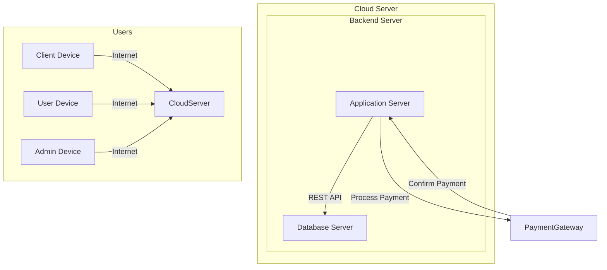

```mermaid
graph TD
    subgraph Cloud Server
        subgraph Backend Server
            AppServer[Application Server]
            DBServer[Database Server]
        end
    end

    subgraph Users
        ClientDevice[Client Device] -- Internet --> CloudServer
        UserDevice[User Device] -- Internet --> CloudServer
        AdminDevice[Admin Device] -- Internet --> CloudServer
    end

    AppServer -- REST API --> DBServer
    AppServer -- Process Payment --> PaymentGateway
    PaymentGateway -- Confirm Payment --> AppServer
```
