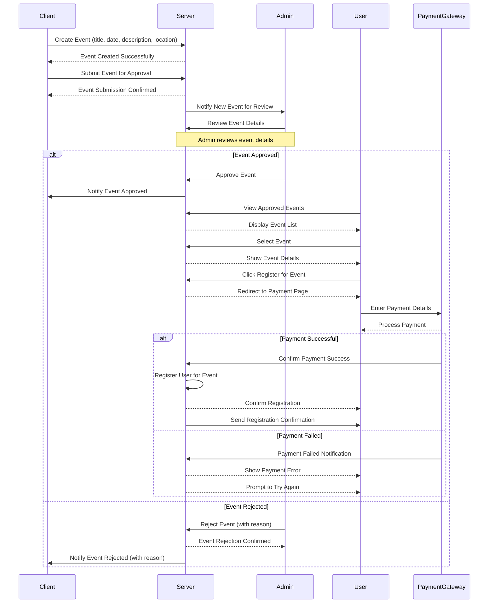

```mermaid

    sequenceDiagram
    participant Client
    participant Server
    participant Admin
    participant User
    participant PaymentGateway

    Client->>Server: Create Event (title, date, description, location)
    Server-->>Client: Event Created Successfully
    Client->>Server: Submit Event for Approval
    Server-->>Client: Event Submission Confirmed
    Server->>Admin: Notify New Event for Review
    Admin->>Server: Review Event Details
    Note over Admin,Server: Admin reviews event details

    alt Event Approved
        Admin->>Server: Approve Event
        Server->>Client: Notify Event Approved

        User->>Server: View Approved Events
        Server-->>User: Display Event List
        User->>Server: Select Event
        Server-->>User: Show Event Details
        User->>Server: Click Register for Event
        Server-->>User: Redirect to Payment Page

        User->>PaymentGateway: Enter Payment Details
        PaymentGateway-->>User: Process Payment

        alt Payment Successful
            PaymentGateway->>Server: Confirm Payment Success
            Server->>Server: Register User for Event
            Server-->>User: Confirm Registration
            Server->>User: Send Registration Confirmation
        else Payment Failed
            PaymentGateway->>Server: Payment Failed Notification
            Server-->>User: Show Payment Error
            Server-->>User: Prompt to Try Again
        end

    else Event Rejected
        Admin->>Server: Reject Event (with reason)
        Server-->>Admin: Event Rejection Confirmed
        Server->>Client: Notify Event Rejected (with reason)
    end

```
