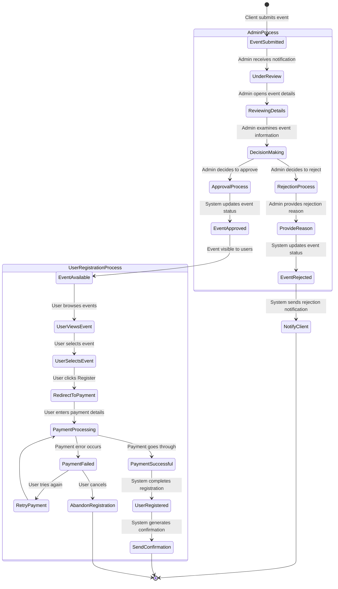

```mermaid


    stateDiagram-v2
    [*] --> EventSubmitted: Client submits event

    state AdminProcess {
        EventSubmitted --> UnderReview: Admin receives notification
        UnderReview --> ReviewingDetails: Admin opens event details
        ReviewingDetails --> DecisionMaking: Admin examines event information
        DecisionMaking --> ApprovalProcess: Admin decides to approve
        DecisionMaking --> RejectionProcess: Admin decides to reject
        ApprovalProcess --> EventApproved: System updates event status
        RejectionProcess --> ProvideReason: Admin provides rejection reason
        ProvideReason --> EventRejected: System updates event status
    }

    EventApproved --> EventAvailable: Event visible to users
    EventRejected --> NotifyClient: System sends rejection notification
    NotifyClient --> [*]

    state UserRegistrationProcess {
        EventAvailable --> UserViewsEvent: User browses events
        UserViewsEvent --> UserSelectsEvent: User selects event
        UserSelectsEvent --> RedirectToPayment: User clicks Register
        RedirectToPayment --> PaymentProcessing: User enters payment details

        PaymentProcessing --> PaymentSuccessful: Payment goes through
        PaymentProcessing --> PaymentFailed: Payment error occurs

        PaymentFailed --> RetryPayment: User tries again
        RetryPayment --> PaymentProcessing
        PaymentFailed --> AbandonRegistration: User cancels

        PaymentSuccessful --> UserRegistered: System completes registration
        UserRegistered --> SendConfirmation: System generates confirmation
    }

    SendConfirmation --> [*]
    AbandonRegistration --> [*]

```
