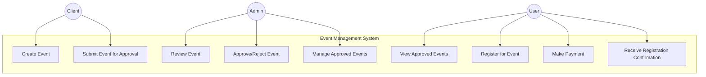
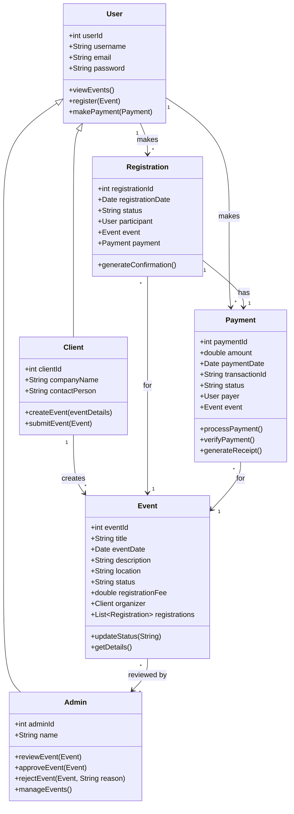
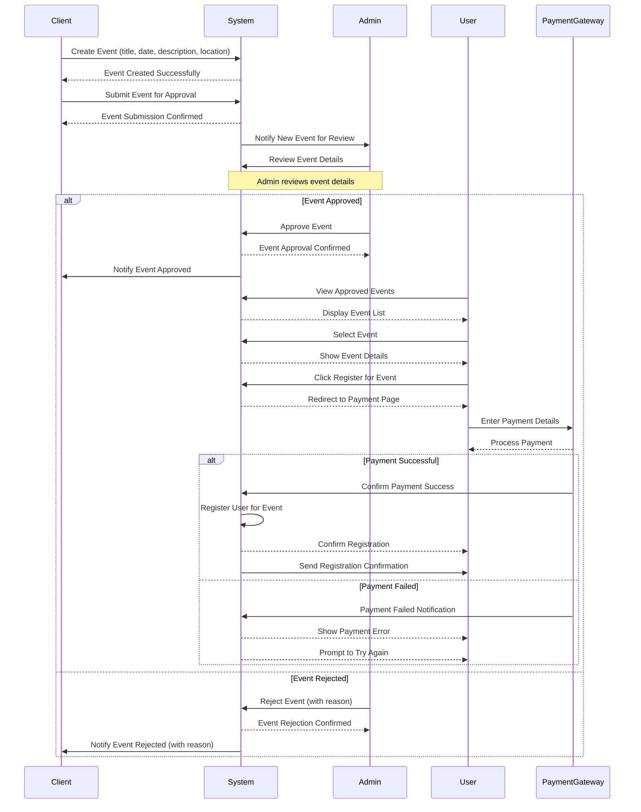
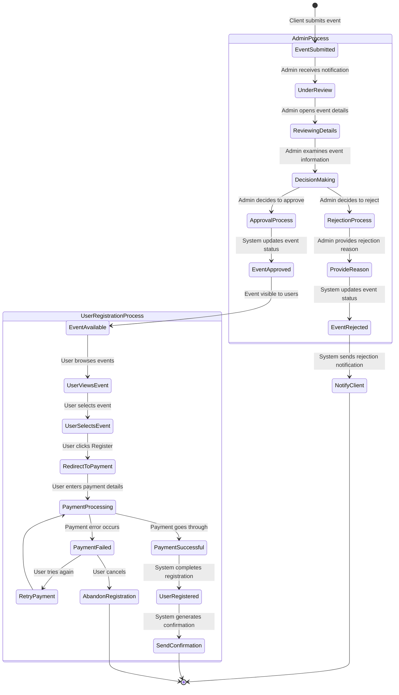

```mermaid
graph TD
    subgraph Event Management System
    UC1[Create Event]
    UC2[Submit Event for Approval]
    UC3[Review Event]
    UC4[Approve/Reject Event]
    UC5[View Approved Events]
    UC6[Register for Event]
    UC7[Make Payment]
    UC8[Receive Registration Confirmation]
    UC9[Manage Approved Events]
    end

    Client1((Client))
    Admin1((Admin))
    User1((User))

    Client1 --> UC1
    Client1 --> UC2
    Admin1 --> UC3
    Admin1 --> UC4
    Admin1 --> UC9
    User1 --> UC5
    User1 --> UC6
    User1 --> UC7
    User1 --> UC8
```

```mermaid
    classDiagram
    class User {
        +int userId
        +String username
        +String email
        +String password
        +viewEvents()
        +register(Event)
        +makePayment(Payment)
    }

    class Client {
        +int clientId
        +String companyName
        +String contactPerson
        +createEvent(eventDetails)
        +submitEvent(Event)
    }

    class Admin {
        +int adminId
        +String name
        +reviewEvent(Event)
        +approveEvent(Event)
        +rejectEvent(Event, String reason)
        +manageEvents()
    }

    class Event {
        +int eventId
        +String title
        +Date eventDate
        +String description
        +String location
        +String status
        +double registrationFee
        +Client organizer
        +List~Registration~ registrations
        +updateStatus(String)
        +getDetails()
    }

    class Registration {
        +int registrationId
        +Date registrationDate
        +String status
        +User participant
        +Event event
        +Payment payment
        +generateConfirmation()
    }

    class Payment {
        +int paymentId
        +double amount
        +Date paymentDate
        +String transactionId
        +String status
        +User payer
        +Event event
        +processPayment()
        +verifyPayment()
        +generateReceipt()
    }

    User <|-- Client
    User <|-- Admin
    Client "1" --> "*" Event : creates
    Event "*" --> "1" Admin : reviewed by
    User "1" --> "*" Registration : makes
    Registration "*" --> "1" Event : for
    User "1" --> "*" Payment : makes
    Registration "1" --> "1" Payment : has
    Payment "*" --> "1" Event : for
```

```mermaid

    sequenceDiagram
    participant Client
    participant System
    participant Admin
    participant User
    participant PaymentGateway

    Client->>System: Create Event (title, date, description, location)
    System-->>Client: Event Created Successfully
    Client->>System: Submit Event for Approval
    System-->>Client: Event Submission Confirmed
    System->>Admin: Notify New Event for Review
    Admin->>System: Review Event Details
    Note over Admin,System: Admin reviews event details

    alt Event Approved
        Admin->>System: Approve Event
        System-->>Admin: Event Approval Confirmed
        System->>Client: Notify Event Approved

        User->>System: View Approved Events
        System-->>User: Display Event List
        User->>System: Select Event
        System-->>User: Show Event Details
        User->>System: Click Register for Event
        System-->>User: Redirect to Payment Page

        User->>PaymentGateway: Enter Payment Details
        PaymentGateway-->>User: Process Payment

        alt Payment Successful
            PaymentGateway->>System: Confirm Payment Success
            System->>System: Register User for Event
            System-->>User: Confirm Registration
            System->>User: Send Registration Confirmation
        else Payment Failed
            PaymentGateway->>System: Payment Failed Notification
            System-->>User: Show Payment Error
            System-->>User: Prompt to Try Again
        end

    else Event Rejected
        Admin->>System: Reject Event (with reason)
        System-->>Admin: Event Rejection Confirmed
        System->>Client: Notify Event Rejected (with reason)
    end

```

```mermaid


    stateDiagram-v2
    [*] --> EventSubmitted: Client submits event

    state AdminProcess {
        EventSubmitted --> UnderReview: Admin receives notification
        UnderReview --> ReviewingDetails: Admin opens event details
        ReviewingDetails --> DecisionMaking: Admin examines event information
        DecisionMaking --> ApprovalProcess: Admin decides to approve
        DecisionMaking --> RejectionProcess: Admin decides to reject
        ApprovalProcess --> EventApproved: System updates event status
        RejectionProcess --> ProvideReason: Admin provides rejection reason
        ProvideReason --> EventRejected: System updates event status
    }

    EventApproved --> EventAvailable: Event visible to users
    EventRejected --> NotifyClient: System sends rejection notification
    NotifyClient --> [*]

    state UserRegistrationProcess {
        EventAvailable --> UserViewsEvent: User browses events
        UserViewsEvent --> UserSelectsEvent: User selects event
        UserSelectsEvent --> RedirectToPayment: User clicks Register
        RedirectToPayment --> PaymentProcessing: User enters payment details

        PaymentProcessing --> PaymentSuccessful: Payment goes through
        PaymentProcessing --> PaymentFailed: Payment error occurs

        PaymentFailed --> RetryPayment: User tries again
        RetryPayment --> PaymentProcessing
        PaymentFailed --> AbandonRegistration: User cancels

        PaymentSuccessful --> UserRegistered: System completes registration
        UserRegistered --> SendConfirmation: System generates confirmation
    }

    SendConfirmation --> [*]
    AbandonRegistration --> [*]

```
