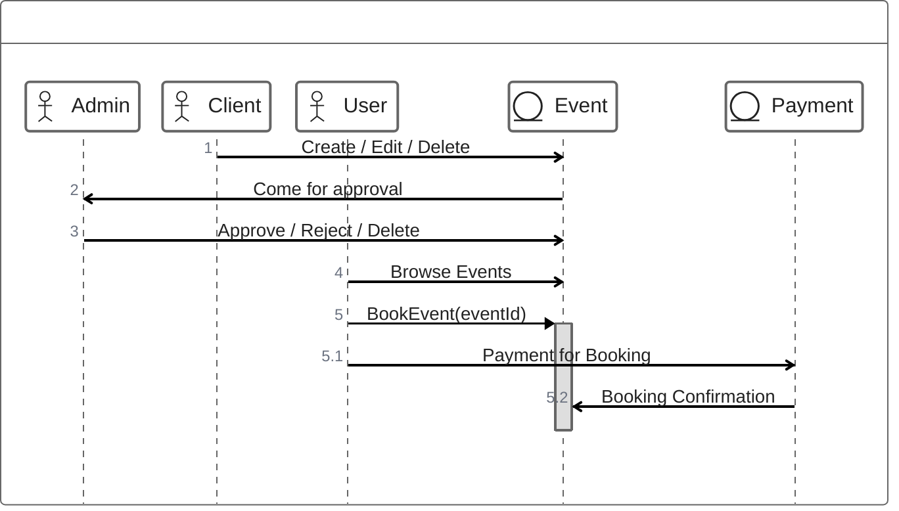

```mermaid
zenuml

@Actor Admin
@Actor Client
@Actor User
@Entity Event
@Entity Payment

Client -> Event: Create / Edit / Delete

Event -> Admin: Come for approval
Admin -> Event: Approve / Reject / Delete

User -> Event: Browse Events
User -> Event.BookEvent(eventId) {
    User -> Payment: Payment for Booking
    Payment -> Event: Booking Confirmation
}

```
